# Claude Code Multi-Agent Orchestration Guide

> A comprehensive tutorial on coordinating multiple Claude agents — from subagents to full agent teams — with visual diagrams, copy-paste-ready definitions, and a step-by-step trace walkthrough.

---

## Table of Contents

- [Section 0: Official Documentation Reference](#section-0-official-documentation-reference)
- [Section 1: Introduction](#section-1-introduction)
- [Section 2: Core Concepts](#section-2-core-concepts)
- [Section 3: Pattern 1 — Subagents (Task Tool)](#section-3-pattern-1--subagents-task-tool)
- [Section 4: Pattern 2 — Agent Teams (Experimental)](#section-4-pattern-2--agent-teams-experimental)
- [Section 5: Side-by-Side Comparison](#section-5-side-by-side-comparison)
- [Section 6: Hands-On Scenario — Building a Task Manager App](#section-6-hands-on-scenario--building-a-task-manager-app)
- [Section 7: Complete Agent Definitions](#section-7-complete-agent-definitions)
- [Section 8: Task Delegation Patterns](#section-8-task-delegation-patterns)
- [Section 9: Best Practices and Pitfalls](#section-9-best-practices-and-pitfalls)
- [Section 10: Quick Reference Card](#section-10-quick-reference-card)

---

## Section 0: Official Documentation Reference

> **Ground Truth** — This section presents verified facts from Anthropic's official documentation. All subsequent sections build upon these definitions.

### Subagents

**Source:** [code.claude.com/docs/en/sub-agents](https://code.claude.com/docs/en/sub-agents)

**Definition:** Subagents are *"specialized AI assistants that handle specific types of tasks. Each subagent runs in its own context window with a custom system prompt, specific tool access, and independent permissions."*

**Key characteristics:**

- Invoked via the **Task tool** — the main agent delegates, and results return to the caller only
- Subagents **cannot spawn other subagents** (single nesting level)
- Subagent definitions are **Markdown files with YAML frontmatter** stored in `.claude/agents/`
- Production-ready and enabled by default

**Built-in subagents:**

| Subagent | Model | Tools | Purpose |
|----------|-------|-------|---------|
| **Explore** | Haiku (fast) | Read-only | File discovery, codebase exploration |
| **Plan** | Inherits from main | Read-only | Codebase research for planning |
| **General-purpose** | Inherits from main | All tools | Complex multi-step tasks |
| **Bash** | Inherits | Terminal | Running commands in separate context |

**Agent definition frontmatter fields:**

| Field | Required | Description |
|-------|----------|-------------|
| `name` | Yes | Unique identifier (lowercase, hyphens) |
| `description` | Yes | When Claude should delegate to this subagent |
| `tools` | No | Tools the subagent can use (inherits all if omitted) |
| `disallowedTools` | No | Tools to deny |
| `model` | No | `sonnet`, `opus`, `haiku`, or `inherit` (default) |
| `permissionMode` | No | `default`, `acceptEdits`, `dontAsk`, `bypassPermissions`, `plan` |
| `maxTurns` | No | Maximum agentic turns before stopping |
| `skills` | No | Skills to preload into the subagent's context |
| `memory` | No | Persistent memory scope: `user`, `project`, `local` |
| `hooks` | No | Lifecycle hooks scoped to this subagent |
| `background` | No | `true` to always run as background task |
| `isolation` | No | `worktree` for isolated git worktree |

**Scopes (highest to lowest priority):**

| Location | Scope | Priority |
|----------|-------|----------|
| `--agents` CLI flag | Current session | 1 (highest) |
| `.claude/agents/` | Current project | 2 |
| `~/.claude/agents/` | All projects | 3 |
| Plugin `agents/` directory | Where plugin is enabled | 4 (lowest) |

**Official example — `.claude/agents/code-reviewer.md`:**

```markdown
---
name: code-reviewer
description: Expert code review specialist. Proactively reviews code for quality, security, and maintainability.
tools: Read, Grep, Glob, Bash
model: inherit
---

You are a senior code reviewer ensuring high standards of code quality and security.

When invoked:
1. Run git diff to see recent changes
2. Focus on modified files
3. Begin review immediately

Review checklist:
- Code is clear and readable
- No duplicated code
- Proper error handling
- No exposed secrets or API keys
- Good test coverage

Provide feedback organized by priority:
- Critical issues (must fix)
- Warnings (should fix)
- Suggestions (consider improving)
```

---

### Agent Teams

**Source:** [code.claude.com/docs/en/agent-teams](https://code.claude.com/docs/en/agent-teams)

**Definition:** Agent teams *"let you coordinate multiple Claude Code instances working together. One session acts as the team lead, coordinating work, assigning tasks, and synthesizing results. Teammates work independently, each in its own context window, and communicate directly with each other."*

**Key characteristics:**

- **Experimental** — disabled by default
- Enable via `CLAUDE_CODE_EXPERIMENTAL_AGENT_TEAMS` environment variable or settings.json
- Teammates are **fully independent Claude Code instances** (not subprocesses)
- Teammates **cannot spawn their own teams** (no nested teams)

**Four components:**

| Component | Role |
|-----------|------|
| **Team Lead** | Main session that creates the team, spawns teammates, coordinates work |
| **Teammates** | Separate Claude Code instances working on assigned tasks |
| **Task List** | Shared list of work items that teammates claim and complete |
| **Mailbox** | Messaging system for communication between agents |

**Communication types:**

| Message Type | Description |
|-------------|-------------|
| `message` | Send to one specific teammate |
| `broadcast` | Send to all teammates simultaneously |
| `approvePlan` | Lead approves a teammate's proposed plan |
| `rejectPlan` | Lead rejects a plan with feedback |
| `requestShutdown` | Ask a teammate to shut down |
| `approveShutdown` | Teammate agrees to shut down |

**Display modes:**

| Mode | Description |
|------|-------------|
| **In-process** | All teammates in main terminal; Shift+Down to cycle |
| **Split panes** | Each teammate in own pane (requires tmux or iTerm2) |

**Storage:**

- Team config: `~/.claude/teams/{team-name}/config.json`
- Task list: `~/.claude/tasks/{team-name}/`

**Hooks:**

| Hook | When it fires |
|------|---------------|
| `TeammateIdle` | Teammate is about to go idle |
| `TaskCompleted` | Task is being marked complete |

---

### Agent SDK

**Source:** [platform.claude.com/docs/en/agent-sdk/overview](https://platform.claude.com/docs/en/agent-sdk/overview)

**Installation:**

```bash
# Python
pip install claude-agent-sdk

# TypeScript
npm install @anthropic-ai/claude-agent-sdk
```

**Key difference from Client SDK:** With the Client SDK, *you* implement the tool loop. With the Agent SDK, Claude handles tool execution autonomously.

```python
# Client SDK: You implement the tool loop
response = client.messages.create(...)
while response.stop_reason == "tool_use":
    result = your_tool_executor(response.tool_use)
    response = client.messages.create(tool_result=result, **params)

# Agent SDK: Claude handles tools autonomously
async for message in query(prompt="Fix the bug in auth.py"):
    print(message)
```

**Built-in tools:**

| Tool | What it does |
|------|-------------|
| Read | Read any file in the working directory |
| Write | Create new files |
| Edit | Make precise edits to existing files |
| Bash | Run terminal commands |
| Glob | Find files by pattern |
| Grep | Search file contents with regex |
| WebSearch | Search the web |
| WebFetch | Fetch and parse web pages |
| AskUserQuestion | Ask user clarifying questions |

**SDK subagents via `AgentDefinition`:**

```python
from claude_agent_sdk import query, ClaudeAgentOptions, AgentDefinition

async for message in query(
    prompt="Use the code-reviewer agent to review this codebase",
    options=ClaudeAgentOptions(
        allowed_tools=["Read", "Glob", "Grep", "Task"],
        agents={
            "code-reviewer": AgentDefinition(
                description="Expert code reviewer.",
                prompt="Analyze code quality and suggest improvements.",
                tools=["Read", "Glob", "Grep"],
            )
        },
    ),
):
    print(message)
```

---

### Official Comparison: Subagents vs Agent Teams

*Reproduced from official documentation.*

| | Subagents | Agent Teams |
|---|-----------|-------------|
| **Context** | Own context window; results return to caller | Own context window; fully independent |
| **Communication** | Report results back to main agent only | Teammates message each other directly |
| **Coordination** | Main agent manages all work | Shared task list with self-coordination |
| **Best for** | Focused tasks where only the result matters | Complex work requiring discussion and collaboration |
| **Token cost** | Lower: results summarized back to main context | Higher: each teammate is a separate Claude instance |

---

### Reference Links

| Topic | URL |
|-------|-----|
| Subagents | https://code.claude.com/docs/en/sub-agents |
| Agent Teams | https://code.claude.com/docs/en/agent-teams |
| Agent SDK Overview | https://platform.claude.com/docs/en/agent-sdk/overview |
| Agent SDK Subagents | https://platform.claude.com/docs/en/agent-sdk/subagents |
| Claude Code Overview | https://code.claude.com/docs/en/overview |

---

## Section 1: Introduction

### What Is Multi-Agent Orchestration?

Multi-agent orchestration is the practice of coordinating multiple AI agents — each with their own context, tools, and instructions — to collaborate on tasks that are too large or complex for a single agent. Instead of one agent trying to do everything, you decompose work into specialized roles and let agents focus on what they do best.

Claude Code supports two distinct patterns for this:

1. **Subagents** — The main agent spawns specialized workers via the Task tool. Results flow back to the caller. Production-ready.
2. **Agent Teams** — Multiple independent Claude Code sessions coordinate through a shared task list and mailbox. Experimental.

### What You Will Learn

By the end of this guide, you will be able to:

- Explain the difference between subagents and agent teams
- Write agent definition files with YAML frontmatter
- Choose the right pattern for a given task
- Set up a multi-agent workflow for a real project
- Understand how agents communicate, delegate, and coordinate

### Diagram 1: Learning Path Overview

```mermaid
%%{init: {
  'theme': 'base',
  'themeVariables': {
    'primaryColor': '#1e40af',
    'primaryTextColor': '#ffffff',
    'primaryBorderColor': '#1e3a8a',
    'lineColor': '#64748b',
    'clusterBkg': '#1e293b',
    'clusterBorder': '#475569',
    'tertiaryColor': '#334155',
    'tertiaryTextColor': '#f8fafc'
  }
}}%%
flowchart LR
    classDef primary fill:#1e40af,stroke:#1e3a8a,stroke-width:1px,color:#ffffff,rx:5,ry:5
    classDef secondary fill:#5b21b6,stroke:#4c1d95,stroke-width:1px,color:#ffffff,rx:5,ry:5
    classDef success fill:#047857,stroke:#065f46,stroke-width:1px,color:#ffffff,rx:5,ry:5
    classDef accent fill:#0e7490,stroke:#155e75,stroke-width:1px,color:#ffffff,rx:5,ry:5

    A((Start)):::primary
    B(Core Concepts):::primary
    C(Subagents):::secondary
    D(Agent Teams):::secondary
    E(Comparison):::accent
    F(Hands-On<br/>Scenario):::accent
    G(Agent<br/>Definitions):::success
    H(Delegation<br/>Patterns):::success
    I((Done)):::primary

    A --> B --> C --> D --> E --> F --> G --> H --> I
```

---

## Section 2: Core Concepts

### Key Terms

| Term | Definition |
|------|-----------|
| **Agent** | A Claude instance with its own system prompt, tool access, and context window |
| **Orchestrator** | The main agent (or team lead) that delegates work to other agents |
| **Context Window** | The isolated conversation history an agent sees — subagents don't share the parent's context |
| **Tool Access** | The set of tools (Read, Write, Bash, etc.) an agent is allowed to use |
| **Agent Definition** | A Markdown file with YAML frontmatter that configures a custom subagent |

### The `.claude/agents/*.md` Convention

Agent definitions live in your project at `.claude/agents/` (or `~/.claude/agents/` for user-level agents). Each file is a Markdown document where:

- The **YAML frontmatter** (between `---` fences) defines metadata: name, description, tools, model
- The **Markdown body** becomes the agent's system prompt

### Diagram 2: Anatomy of an Agent Definition

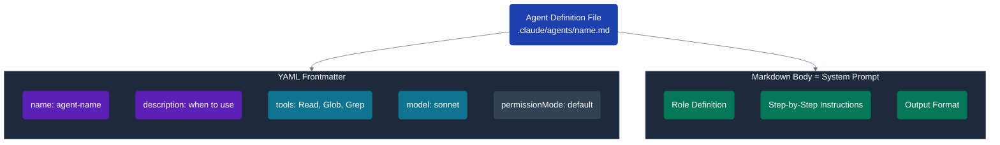

### Agent Definition Template

```markdown
---
name: my-agent
description: Brief description of when Claude should delegate to this agent
tools: Read, Glob, Grep, Bash
model: sonnet
---

You are a [role]. When invoked:

1. [First step]
2. [Second step]
3. [Third step]

Provide output in the following format:
- [Format specification]
```

---

## Section 3: Pattern 1 — Subagents (Task Tool)

### How It Works

The main Claude agent spawns subagents using the **Task tool**. Each subagent:

1. Runs in its **own context window** (isolated from the parent)
2. Receives only its **system prompt** plus basic environment details
3. Works independently using its assigned tools
4. Returns a **result summary** to the main agent
5. **Cannot spawn other subagents** (single nesting level)

This is a **hub-and-spoke** model: the main agent is the hub, subagents are spokes. All communication flows through the hub.

### Key Traits

| Trait | Detail |
|-------|--------|
| **Maturity** | Production-ready, enabled by default |
| **Communication** | One-way: subagent → main agent (results only) |
| **Nesting** | Single level — subagents cannot spawn subagents |
| **Cost** | Lower — results are summarized back to main context |
| **Context** | Each subagent has its own isolated window |
| **Best for** | Focused tasks, parallel research, verbose operations |

### Diagram 3: Subagent Architecture (Hub-and-Spoke)

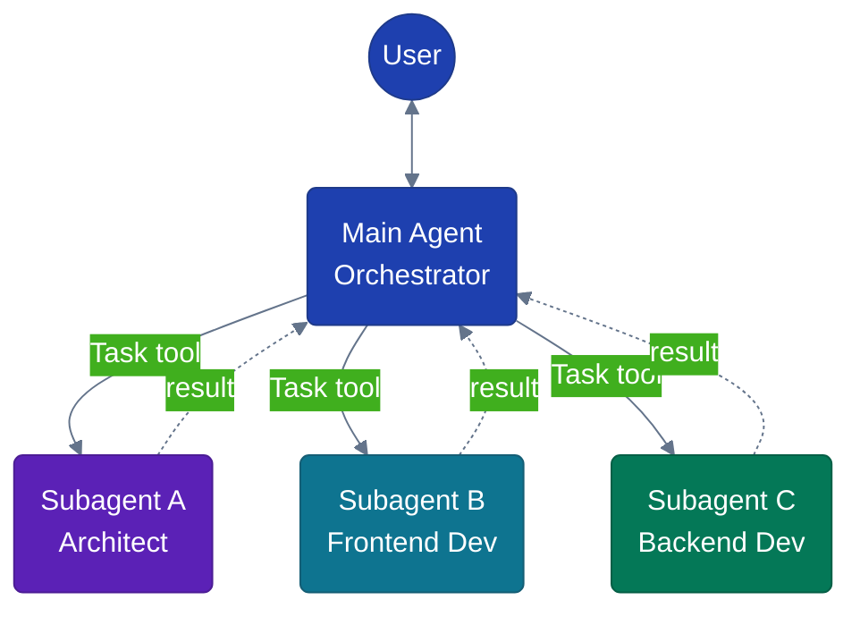

### Diagram 4: Subagent Lifecycle

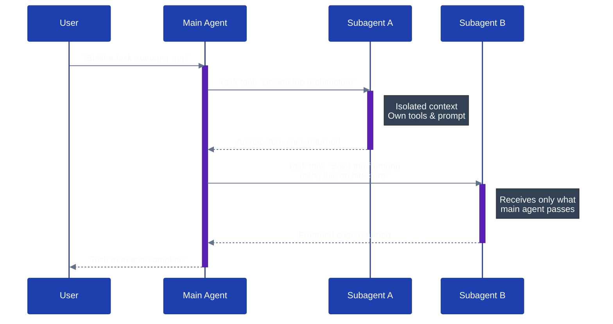

### Step-by-Step Lifecycle

1. **User request** → User asks the main agent to perform a complex task
2. **Delegation** → Main agent calls the Task tool with a prompt and subagent type
3. **Spawn** → A new subagent starts with its own context, system prompt, and tools
4. **Execution** → Subagent works independently (reads files, runs commands, etc.)
5. **Result** → Subagent returns a summary to the main agent
6. **Synthesis** → Main agent incorporates the result and continues (or spawns another subagent)

---

## Section 4: Pattern 2 — Agent Teams (Experimental)

> **Warning:** Agent teams are experimental and disabled by default. Enable via `CLAUDE_CODE_EXPERIMENTAL_AGENT_TEAMS` in your environment or settings.json.

### How It Works

Agent teams coordinate **multiple independent Claude Code instances**. Unlike subagents (which are subprocess-like and report back to one parent), teammates are full sessions that can communicate with each other directly.

### Four Components

| Component | Role |
|-----------|------|
| **Team Lead** | Creates the team, spawns teammates, assigns tasks, synthesizes results |
| **Teammates** | Independent Claude Code sessions that claim and complete tasks |
| **Task List** | Shared work items with states: `pending` → `in_progress` → `completed`. Uses file locking to prevent race conditions |
| **Mailbox** | Messaging system supporting `message`, `broadcast`, `approvePlan`, `rejectPlan`, `requestShutdown`, `approveShutdown` |

### How Communication Works

Teammates don't go through the lead for everything. They can:

- **Message** a specific teammate directly (e.g., "What's the API response shape?")
- **Broadcast** to all teammates at once (e.g., "Architecture is ready, check the spec")
- **Claim tasks** from the shared task list independently
- **Request/approve plans** for review before implementation

### Diagram 5: Agent Teams Architecture (Mesh)

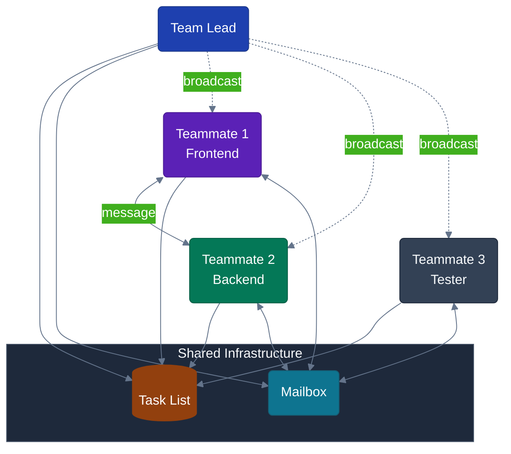

### Diagram 6: Agent Teams Collaboration Sequence

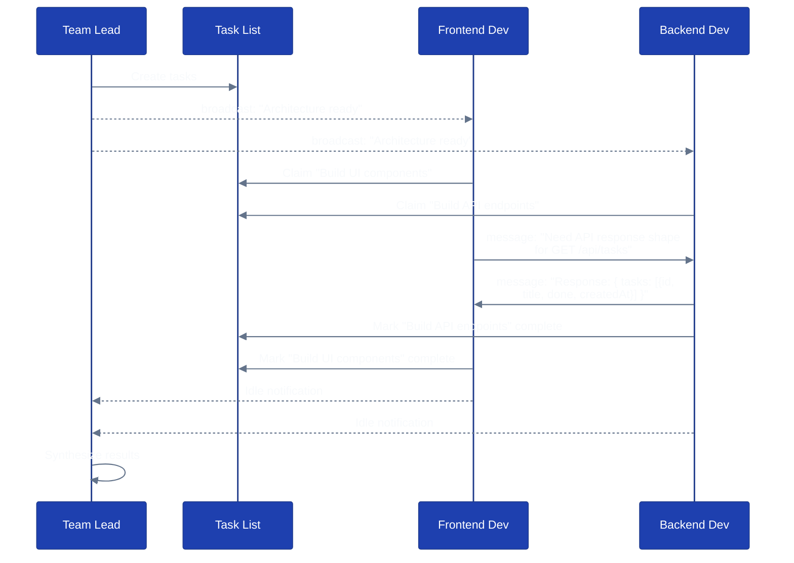

### Enabling Agent Teams

Add to your `settings.json`:

```json
{
  "env": {
    "CLAUDE_CODE_EXPERIMENTAL_AGENT_TEAMS": "1"
  }
}
```

Or set in your shell:

```bash
export CLAUDE_CODE_EXPERIMENTAL_AGENT_TEAMS=1
```

---

## Section 5: Side-by-Side Comparison

### Comprehensive Comparison

| Dimension | Subagents | Agent Teams |
|-----------|-----------|-------------|
| **Maturity** | Production-ready | Experimental (disabled by default) |
| **Communication** | One-way: result → main agent | Peer-to-peer: message, broadcast |
| **Context** | Own window; result returns to caller | Own window; fully independent |
| **Coordination** | Main agent manages everything | Shared task list + self-coordination |
| **Nesting** | Single level (no sub-subagents) | No nested teams |
| **Token cost** | Lower (summarized results) | Higher (each teammate = full session) |
| **Parallelism** | Main agent spawns multiple in parallel | Teammates work concurrently by default |
| **Inter-agent talk** | Not possible — spokes don't see each other | Direct messaging between teammates |
| **Plan approval** | Not applicable | Lead can require plan review |
| **Display** | Inline in main session | In-process or split panes (tmux/iTerm2) |
| **Best for** | Focused tasks, research, verbose ops | Complex collaboration, competing hypotheses |

### Diagram 7: Decision Flowchart — Which Pattern?

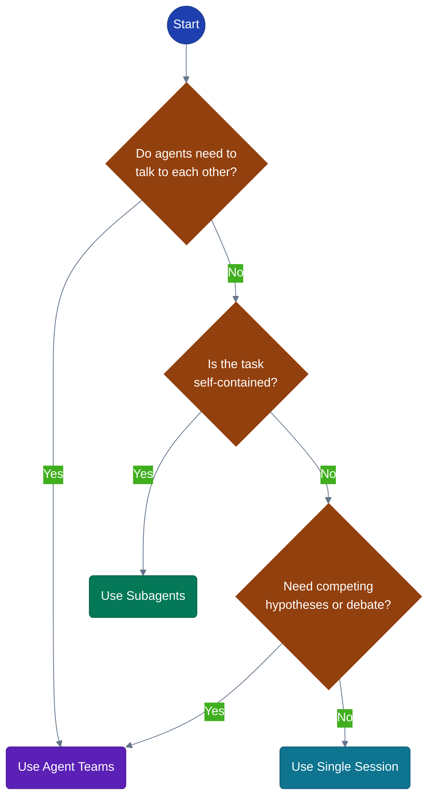

### Diagram 8: Architecture Comparison

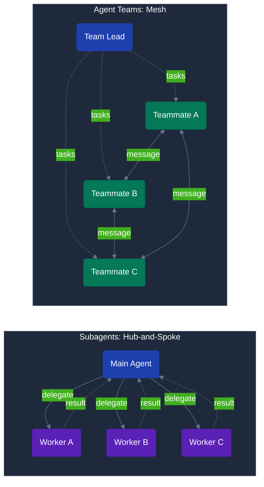

---

## Section 6: Hands-On Scenario — Building a Task Manager App

### The Scenario

We're building a **CRUD task manager** with:

- **React** frontend for the UI
- **Express** backend for the API
- **SQLite** database for persistence

Five roles will collaborate:

| Role | Responsibility |
|------|---------------|
| **Team Lead** | Coordinates all work, synthesizes results |
| **Architect** | Designs the system structure, defines API contracts |
| **Frontend Dev** | Builds React components and UI |
| **Backend Dev** | Implements Express routes and database layer |
| **Tester** | Writes and runs tests for all components |

### Diagram 9: Roles and Responsibilities

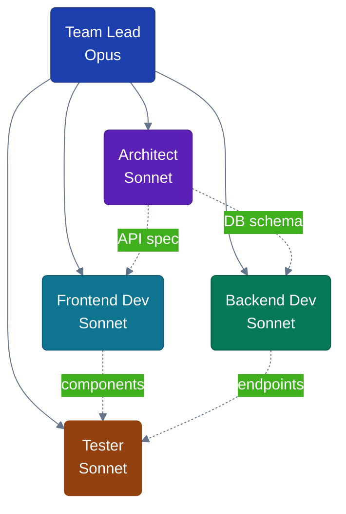

---

### 6a: Subagents Approach

In the subagents pattern, the **main agent is the hub**. It delegates to each subagent and manually relays context between them.

#### Diagram 10: Subagents Task Flow

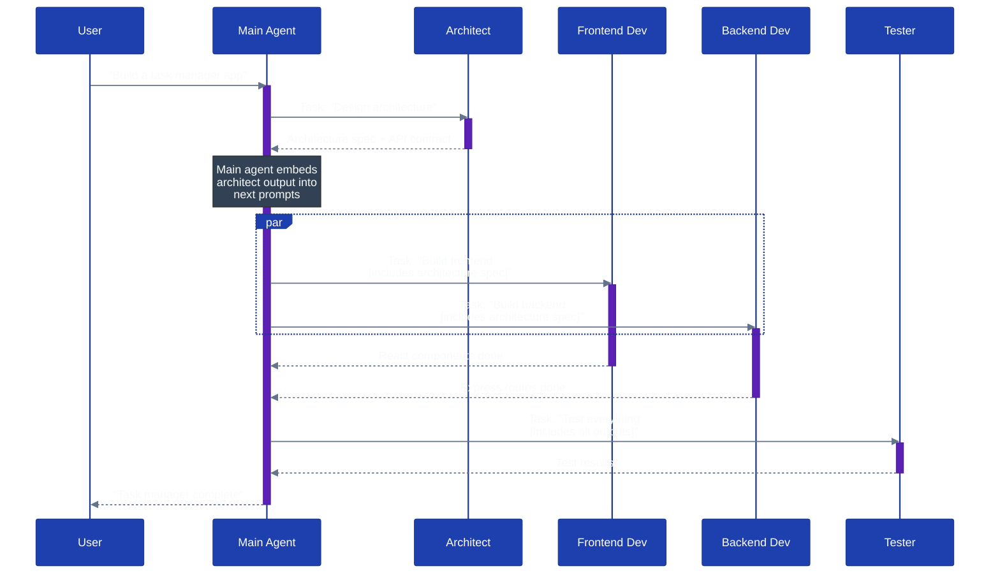

#### Context Relay Example

This is the exact prompt the main agent passes to the Frontend Dev subagent. Notice how it **embeds the Architect's output** as context — this is how information flows through the hub:

```
Build the React frontend for the task manager application.

## Architecture Context (from Architect)

The architect has defined the following structure:

- React frontend at /src/components/
- REST API at /api/tasks
- API response shape: { tasks: [{ id: number, title: string, done: boolean, createdAt: string }] }
- Endpoints: GET /api/tasks, POST /api/tasks, PUT /api/tasks/:id, DELETE /api/tasks/:id

## Your Task

1. Create a TaskList component that fetches and displays tasks
2. Create a TaskForm component for adding new tasks
3. Create a TaskItem component with toggle and delete functionality
4. Wire up API calls to the Express backend

Use React hooks (useState, useEffect). Keep styling minimal with CSS modules.
```

---

### 6b: Agent Teams Approach

In the agent teams pattern, teammates **communicate directly**. The lead creates tasks but doesn't relay messages — teammates discover what they need by messaging each other.

#### Diagram 11: Agent Teams Task Flow

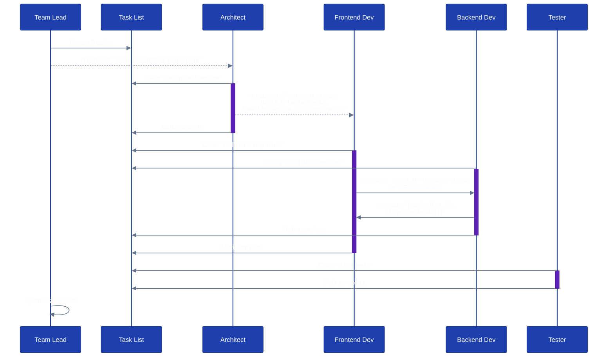

#### Mailbox Message Examples

**Broadcast from Architect** (to all teammates):

```
Architecture ready. REST API at /api/tasks, React frontend at /src/components/.

Endpoints:
- GET    /api/tasks       → list all tasks
- POST   /api/tasks       → create task (body: { title })
- PUT    /api/tasks/:id   → update task (body: { title?, done? })
- DELETE /api/tasks/:id   → delete task

DB schema: tasks(id INTEGER PK, title TEXT, done BOOLEAN DEFAULT 0, createdAt TEXT)
```

**Message from Frontend Dev to Backend Dev:**

```
Need the API response shape for GET /api/tasks. What does the JSON look like?
```

**Message from Backend Dev to Frontend Dev:**

```
Response: { tasks: [{ id: 1, title: "Buy groceries", done: false, createdAt: "2025-01-15T10:30:00Z" }] }

All endpoints return { error: "message" } on failure with appropriate HTTP status codes.
```

**approvePlan from Team Lead** (approving Architect's structure):

```
Plan approved. The REST + React + SQLite architecture is appropriate for this scope.
Proceed with implementation.
```

#### Task List Snapshots

**After Team Lead creates tasks** (all pending):

| # | Task | Status | Owner |
|---|------|--------|-------|
| 1 | Design architecture | `pending` | — |
| 2 | Build UI components | `pending` (blocked by #1) | — |
| 3 | Build API endpoints | `pending` (blocked by #1) | — |
| 4 | Write tests | `pending` (blocked by #2, #3) | — |
| 5 | Integration review | `pending` (blocked by #4) | — |

**During execution** (mixed):

| # | Task | Status | Owner |
|---|------|--------|-------|
| 1 | Design architecture | `completed` | Architect |
| 2 | Build UI components | `in_progress` | Frontend Dev |
| 3 | Build API endpoints | `in_progress` | Backend Dev |
| 4 | Write tests | `pending` (blocked by #2, #3) | — |
| 5 | Integration review | `pending` (blocked by #4) | — |

**After completion** (all done):

| # | Task | Status | Owner |
|---|------|--------|-------|
| 1 | Design architecture | `completed` | Architect |
| 2 | Build UI components | `completed` | Frontend Dev |
| 3 | Build API endpoints | `completed` | Backend Dev |
| 4 | Write tests | `completed` | Tester |
| 5 | Integration review | `completed` | Team Lead |

---

### 6c: Step-by-Step Trace Walkthrough

> This is the **educational centerpiece** — a "debugger view" of multi-agent collaboration. We walk through the same scenario under both patterns, step by step, so you can see exactly how communication differs.

#### Step 1: User Request

| | Subagents | Agent Teams |
|---|-----------|-------------|
| **Who** | User → Main Agent | User → Team Lead |
| **Input** | "Build a task manager with React + Express + SQLite" | Same |
| **What happens** | Main agent plans the delegation strategy | Lead creates a team, spawns 4 teammates, creates shared task list |

#### Step 2: Architecture Design

| | Subagents | Agent Teams |
|---|-----------|-------------|
| **Who** | Main Agent → Architect subagent | Architect claims task #1 from shared list |
| **Sees** | System prompt + user's request (passed by main) | System prompt + project CLAUDE.md + task description |
| **Action** | Reads codebase, designs architecture | Same |
| **Output** | Returns spec to main agent as result text | **Broadcasts** spec to all teammates via mailbox |
| **Key difference** | Result goes **only to main agent** — main must relay it | All teammates receive the broadcast **directly** |

#### Step 3: Frontend & Backend (Parallel)

| | Subagents | Agent Teams |
|---|-----------|-------------|
| **Who** | Main spawns Frontend + Backend subagents in parallel | Frontend and Backend each claim their task from the list |
| **Sees** | System prompt + architecture spec **embedded in the Task prompt by main agent** | System prompt + architecture spec **received via broadcast from Architect** |
| **Action** | Build components / routes independently | Same, but can also message each other |
| **Communication** | Frontend cannot ask Backend anything — they're isolated spokes | Frontend **messages** Backend: "Need the API response shape" |
| **Key difference** | Main agent must anticipate all context needs upfront | Teammates **discover** and request context as they go |

#### Step 4: Information Exchange

| | Subagents | Agent Teams |
|---|-----------|-------------|
| **Who** | N/A — no inter-subagent communication | Frontend Dev ↔ Backend Dev |
| **What happens** | If Frontend needs info from Backend, it can't get it. Main must re-run or anticipate | Backend replies with `{ tasks: [{ id, title, done, createdAt }] }` via message |
| **Key difference** | **No lateral communication** — all flows through the hub | **Direct peer-to-peer** — teammates resolve dependencies themselves |

#### Step 5: Testing

| | Subagents | Agent Teams |
|---|-----------|-------------|
| **Who** | Main Agent → Tester subagent | Tester claims task #4 (unblocked after #2 and #3 complete) |
| **Sees** | System prompt + **all previous outputs embedded by main** (architecture + frontend + backend) | System prompt + project files (reads what Frontend/Backend wrote to disk) |
| **Action** | Writes and runs tests | Same |
| **Output** | Returns test results to main agent | Marks task complete; Lead is notified automatically |

#### Step 6: Synthesis

| | Subagents | Agent Teams |
|---|-----------|-------------|
| **Who** | Main Agent | Team Lead |
| **What happens** | Main has all results in its context. Combines them and reports to user | Lead sees all tasks completed. Reviews outputs and reports to user |
| **Context cost** | All subagent results accumulated in main agent's context window | Each teammate's work stays in its own context. Lead sees summaries |

#### The Core Tradeoff

| | Subagents | Agent Teams |
|---|-----------|-------------|
| **Information flow** | Centralized: everything through the hub | Decentralized: peer-to-peer + shared task list |
| **Flexibility** | Lower: main must anticipate all context needs | Higher: teammates request what they need at runtime |
| **Cost** | Lower: summarized results | Higher: each teammate is a full Claude session |
| **Complexity** | Simpler: one orchestrator, clear hierarchy | More complex: coordination protocol, shared state |
| **When it breaks** | When subagents need info from each other | When coordination overhead exceeds the benefit |

---

## Section 7: Complete Agent Definitions

> These are copy-paste-ready `.claude/agents/*.md` files. All use free tools only (`Read, Write, Edit, Glob, Grep, Bash`).

### `team-lead.md`

```markdown
---
name: team-lead
description: Orchestrates multi-agent workflows. Delegates tasks to specialist agents, relays context between them, and synthesizes final results.
tools: Read, Write, Edit, Glob, Grep, Bash, Task
model: opus
---

You are the team lead for a multi-agent development workflow.

Your responsibilities:
1. Break down the user's request into discrete tasks
2. Delegate each task to the appropriate specialist agent
3. Relay context between agents (embed prior results in new prompts)
4. Verify outputs from each agent before proceeding
5. Synthesize all results into a cohesive deliverable

Delegation strategy:
- Start with the architect for design decisions
- Run frontend and backend in parallel when possible
- Send all outputs to the tester as the final step
- If an agent's output is insufficient, re-delegate with clearer instructions

Available specialist agents: architect, frontend-dev, backend-dev, tester

When relaying context to a specialist, include the relevant outputs from previous
agents verbatim. Do not summarize — specialists need exact API contracts, schemas,
and file paths.
```

### `architect.md`

```markdown
---
name: architect
description: Designs system architecture, defines API contracts, database schemas, and project structure. Use before implementation begins.
tools: Read, Glob, Grep, Bash
model: sonnet
---

You are a software architect. When invoked:

1. Analyze the requirements and existing codebase
2. Define the project structure (directories, key files)
3. Design the API contract (endpoints, request/response shapes)
4. Define the database schema (tables, columns, types)
5. Specify technology choices with brief rationale

Output format:

## Project Structure
- List of directories and their purposes

## API Contract
- Endpoint, method, request body, response shape for each route

## Database Schema
- Table definitions with columns and types

## Technology Choices
- Framework, database, key libraries with one-line rationale

Keep the architecture minimal. Do not over-engineer. Prefer conventions over
configuration.
```

### `frontend-dev.md`

```markdown
---
name: frontend-dev
description: Builds frontend UI components with React. Implements views, forms, and API integration based on provided architecture specs.
tools: Read, Write, Edit, Glob, Grep, Bash
model: sonnet
---

You are a frontend developer specializing in React.

When invoked:
1. Read the architecture spec provided in your prompt
2. Create React components following the defined structure
3. Implement API calls to the specified endpoints
4. Add minimal styling (CSS modules or inline styles)
5. Ensure components handle loading, error, and empty states

Coding standards:
- Use functional components with hooks (useState, useEffect)
- Keep components small and focused (one responsibility each)
- Use fetch() for API calls — no external HTTP libraries
- Name files in PascalCase: TaskList.jsx, TaskForm.jsx
- Export components as default exports

Do not install additional dependencies unless explicitly instructed.
```

### `backend-dev.md`

```markdown
---
name: backend-dev
description: Builds backend API endpoints with Express and SQLite. Implements routes, database queries, and middleware based on provided architecture specs.
tools: Read, Write, Edit, Glob, Grep, Bash
model: sonnet
---

You are a backend developer specializing in Node.js with Express.

When invoked:
1. Read the architecture spec provided in your prompt
2. Set up Express routes matching the API contract
3. Implement SQLite database layer with the defined schema
4. Add input validation and error handling
5. Include CORS middleware for frontend integration

Coding standards:
- Use express.Router() for route organization
- Use better-sqlite3 for synchronous SQLite access
- Return consistent JSON shapes: { data } on success, { error } on failure
- Use appropriate HTTP status codes (200, 201, 400, 404, 500)
- Keep route handlers thin — extract database logic into a separate module

Do not install additional dependencies unless explicitly instructed.
```

### `tester.md`

```markdown
---
name: tester
description: Writes and runs tests for frontend components and backend API endpoints. Validates functionality against the architecture spec.
tools: Read, Write, Edit, Glob, Grep, Bash
model: sonnet
---

You are a test engineer.

When invoked:
1. Read the architecture spec and implementation code
2. Write unit tests for backend API endpoints
3. Write component tests for frontend React components
4. Run all tests and report results
5. If tests fail, report the failure clearly — do not fix the code

Testing standards:
- Use the test framework already in the project (Jest, Vitest, or Node test runner)
- Test happy paths first, then edge cases
- For API tests: test each endpoint with valid input, invalid input, and not-found cases
- For component tests: test rendering, user interactions, and API integration
- Name test files with .test.js or .test.jsx suffix

Output format:

## Test Results
- Total: X passed, Y failed
- List of passing tests (brief)
- List of failing tests with error details

## Coverage Gaps
- Areas not yet covered by tests
```

---

## Section 8: Task Delegation Patterns

Beyond the basic "delegate and collect" flow, there are three common patterns for structuring multi-agent work.

### Pattern A: Sequential Pipeline

Tasks flow in a strict order. Each agent's output feeds into the next.

```
Architect → Frontend Dev → Backend Dev → Tester
```

**When to use:** When each step depends entirely on the previous step's output.

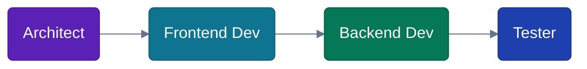

### Pattern B: Parallel Fan-Out

Multiple agents work simultaneously on independent tasks. Results converge at the orchestrator.

**When to use:** When tasks are independent and don't need each other's output.

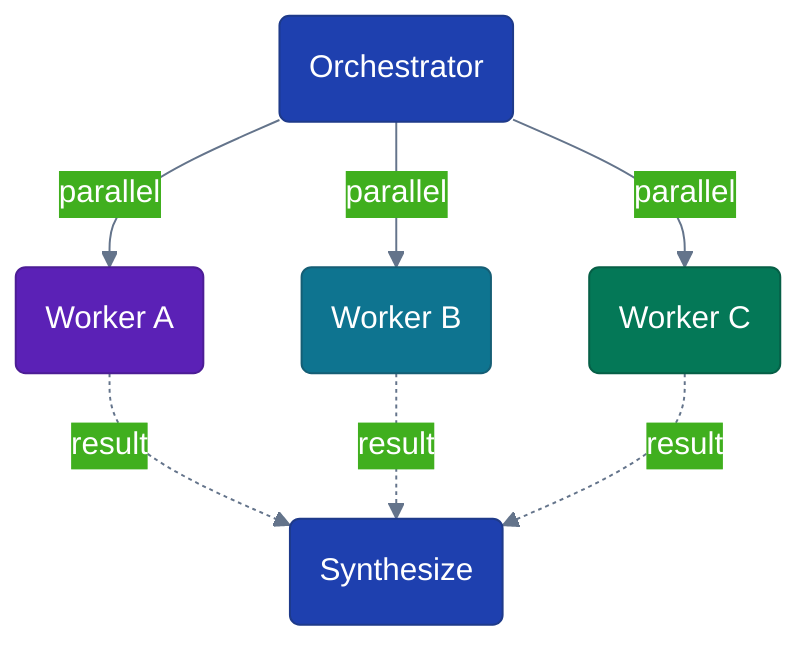

### Pattern C: Iterative Review Loop

An agent produces output, a reviewer evaluates it, and the loop continues until the reviewer approves.

**When to use:** When quality matters and you want automated review cycles.

### Diagram 12: Iterative Review Loop

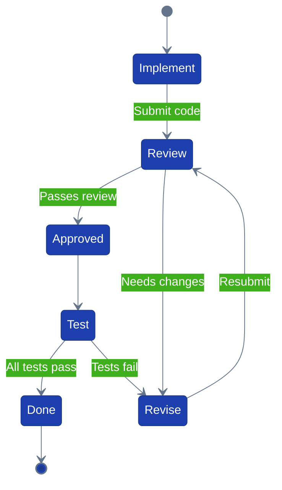

### Combining Patterns

In practice, you combine these patterns. The task manager scenario uses:

1. **Sequential** for Architect → (Frontend, Backend)
2. **Parallel fan-out** for Frontend and Backend working simultaneously
3. **Iterative review** if the Tester finds failures (loop back to the failing agent)

---

## Section 9: Best Practices and Pitfalls

### Best Practices

**1. Keep agent prompts focused (single responsibility)**

Each agent should do one thing well. A "frontend-dev" agent shouldn't also run tests. A "tester" agent shouldn't fix bugs.

**2. Minimize context passing**

In the subagents pattern, every piece of context you pass to a subagent costs tokens. Pass only what's necessary — exact API contracts, not entire conversation histories.

**3. Use appropriate tool sets (least privilege)**

Give each agent only the tools it needs. An architect needs `Read, Glob, Grep` but not `Write`. A tester needs `Read, Bash` but maybe not `Edit`.

**4. Choose the right model per role**

- **Opus** for orchestration, complex reasoning, and synthesis
- **Sonnet** for implementation (frontend, backend, testing)
- **Haiku** for fast read-only tasks (exploration, simple searches)

**5. Write descriptions that trigger correctly**

The `description` field determines when Claude delegates to a subagent. Be specific:

```yaml
# Good — tells Claude exactly when to use this agent
description: Reviews code for quality and security. Use after writing or modifying code.

# Bad — too vague, Claude won't know when to delegate
description: A helpful coding agent.
```

**6. Use parallel delegation when possible**

If two subagents don't depend on each other, spawn them in parallel. This reduces wall-clock time.

### Common Pitfalls

| Pitfall | Problem | Fix |
|---------|---------|-----|
| **Over-engineering** | Creating 10 agents for a task that needs 2 | Start with fewer agents; add more only when needed |
| **Vague prompts** | "Build the thing" gives agents nothing to work with | Include exact specs, file paths, and constraints |
| **Too many tools** | Agent wastes time exploring irrelevant tools | Restrict to only the tools the role requires |
| **Missing context relay** | Subagent doesn't know about the architect's decisions | Embed prior agent outputs verbatim in the Task prompt |
| **Not using dependencies** | Tasks run before their prerequisites are done | Use task dependencies (`blocked by`) in agent teams |
| **Ignoring cost** | Agent teams with 5 teammates on a simple task | Use subagents for focused work; teams for complex collaboration |

---

## Section 10: Quick Reference Card

### Pattern Comparison (Condensed)

| | Subagents | Agent Teams |
|---|-----------|-------------|
| **Status** | Production | Experimental |
| **Enable** | Default on | `CLAUDE_CODE_EXPERIMENTAL_AGENT_TEAMS=1` |
| **Communication** | Hub-and-spoke | Peer-to-peer mesh |
| **Cost** | Lower | Higher |
| **Use when** | Focused, independent tasks | Collaboration, competing hypotheses |

### Minimal Agent Definition Template

```markdown
---
name: my-agent
description: What this agent does and when to use it
tools: Read, Glob, Grep
model: sonnet
---

You are a [role]. When invoked:

1. [Step 1]
2. [Step 2]
3. [Step 3]
```

### Agent SDK Quick Start

```python
# Python
from claude_agent_sdk import query, ClaudeAgentOptions, AgentDefinition

async for message in query(
    prompt="Your task here",
    options=ClaudeAgentOptions(
        allowed_tools=["Read", "Edit", "Bash", "Task"],
        agents={
            "my-agent": AgentDefinition(
                description="Agent description",
                prompt="System prompt",
                tools=["Read", "Glob"],
            )
        },
    ),
):
    print(message)
```

```typescript
// TypeScript
import { query } from "@anthropic-ai/claude-agent-sdk";

for await (const message of query({
  prompt: "Your task here",
  options: {
    allowedTools: ["Read", "Edit", "Bash", "Task"],
    agents: {
      "my-agent": {
        description: "Agent description",
        prompt: "System prompt",
        tools: ["Read", "Glob"],
      }
    }
  }
})) {
  console.log(message);
}
```

### Official Documentation

| Topic | URL |
|-------|-----|
| Subagents | https://code.claude.com/docs/en/sub-agents |
| Agent Teams | https://code.claude.com/docs/en/agent-teams |
| Agent SDK Overview | https://platform.claude.com/docs/en/agent-sdk/overview |
| Agent SDK Subagents | https://platform.claude.com/docs/en/agent-sdk/subagents |
| Claude Code Overview | https://code.claude.com/docs/en/overview |
